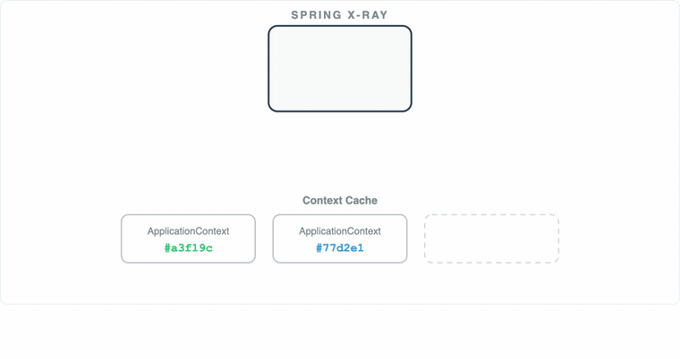
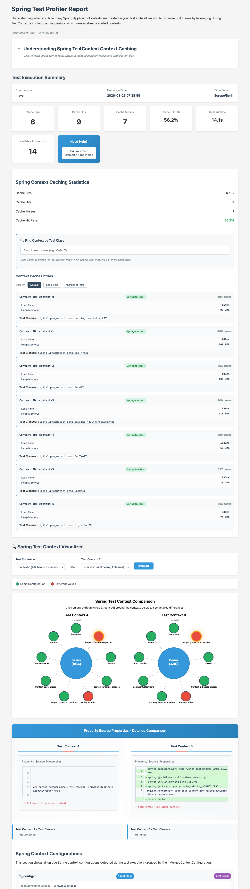
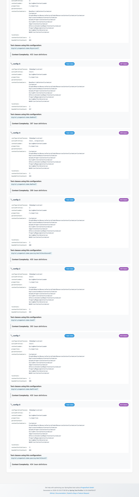

# Profile Your Tests. Speed Up Your Build. Ship Faster 🚤

<p align="center">
  
</p>

Spring's `TestContext` Context Caching is one of the **most** **unknown hidden gems of testing with Spring Boot** - it can cut your build times in half, and often even more.

Yet most developers aren't aware of it, and once they discover it, they need a tool to tell them how to optimize their test suite. That's where the Spring Test Profiler comes in.

The Spring Test Profiler is a Spring Test utility that provides visualization and insights for Spring Test execution, with a focus on Spring context caching. It helps you identify optimization opportunities in your Spring Test suite to speed up your builds and ship to production faster and with more confidence.

Fast build times = fast feedback and accelerated feature delivery!

Find [more information](https://pragmatech.digital/products/spring-test-profiler/) about the profiler on our website.

## Documentation

The full documentation lives in the [GitHub wiki](https://github.com/PragmaTech-GmbH/spring-test-profiler/wiki) - this README only covers the quick start. Key pages:

- [Getting Started](https://github.com/PragmaTech-GmbH/spring-test-profiler/wiki/Getting-Started)
- [Understanding the Report](https://github.com/PragmaTech-GmbH/spring-test-profiler/wiki/Understanding-the-Report)
- [Spring Context Caching](https://github.com/PragmaTech-GmbH/spring-test-profiler/wiki/Spring-Context-Caching)
- [Configuration Reference](https://github.com/PragmaTech-GmbH/spring-test-profiler/wiki/Configuration-Reference)
- [Advanced Usage](https://github.com/PragmaTech-GmbH/spring-test-profiler/wiki/Advanced-Usage)
- [New Features](https://github.com/PragmaTech-GmbH/spring-test-profiler/wiki/New-Features)

## How Context Caching Works

Spring caches ApplicationContexts across tests: it X-rays each test's configuration, merges all customization points into a `MergedContextConfiguration`, and uses its hashCode as the cache key.

Same key means instant reuse - one tiny difference means a slow, brand-new context. The report's theory section shows this as an animation:



For a detailed explanation of the caching mechanics, see [Spring Context Caching](https://github.com/PragmaTech-GmbH/spring-test-profiler/wiki/Spring-Context-Caching) in the wiki.

## Features

**Overall goal**: Identify optimization opportunities in your Spring Test suite to speed up your builds and ship to production faster and with more confidence 🚤

This profiler helps you:

- Track Spring Test context caching statistics for your test suite
- Show context reuse metrics and cache hit/miss ratios
- Identify tests that couldn't reuse contexts and explain why
- Drastically reduce the build time of your project

## Sample Report

<table>
  <tr>
    <td></td>
    <td></td>
  </tr>
</table>


## Requirements

[](https://github.com/PragmaTech-GmbH/spring-test-profiler/actions/workflows/ci.yml?query=branch%3Amain)

This profiler works with Java 17+ and is compatible with:

- Spring Framework 5 (Spring Boot 2)
- Spring Framework 6 (Spring Boot 3)
- Spring Framework 7 (Spring Boot 4)

## Prototype Phase

> [!WARNING]
> This project is highly work-in-progress and should be considered a prototype to gather feedback and ideas for future development.

The main current limitations are missing support for parallel test execution and separate reports per Gradle test task and per Surefire/Failsafe run. See [Troubleshooting and Limitations](https://github.com/PragmaTech-GmbH/spring-test-profiler/wiki/Troubleshooting-and-Limitations) in the wiki for the full list.

## Usage

[](/spring-test-profiler-extension/pom.xml)

### 1. Add the Dependency

#### Quick Start Maven

Add the dependency to your project:

```xml
<dependency>
  <groupId>digital.pragmatech.testing</groupId>
  <artifactId>spring-test-profiler</artifactId>
  <version>0.2.2</version>
  <scope>test</scope>
</dependency>
```

#### Quick Start Gradle

Add the dependency to your project:

```groovy
testRuntimeOnly("digital.pragmatech.testing:spring-test-profiler:0.2.2")
```


### 2. Activate the Profiler

Pick **either one** of the following methods to activate the profiler in your tests.

#### Automatically for all Your Tests (Recommended)

Add a file named `META-INF/spring.factories` to your resources directory with the following content:

```text
org.springframework.test.context.TestExecutionListener=\
digital.pragmatech.testing.SpringTestProfilerListener
org.springframework.context.ApplicationContextInitializer=\
digital.pragmatech.testing.diagnostic.ContextDiagnosticApplicationInitializer
```

#### Manually for Specific Tests

Add the `@TestExecutionListeners` and `@ContextConfiguration` annotations to your test classes:

```java
@TestExecutionListeners(
  value = {SpringTestProfilerListener.class},
  mergeMode = TestExecutionListeners.MergeMode.MERGE_WITH_DEFAULTS
)
@ContextConfiguration(initializers = ContextDiagnosticApplicationInitializer.class)
```

This needs to be done for each test class where you want to use the profiler. Preferably, use this on a central abstract integration test class or use the automatic activation method above.

### 3. Run Your Tests

Execute your tests:

```bash
# Maven
./mvnw verify

# Gradle
./gradlew build
```

### 4. Analyze the Generated Report

After test execution, find the HTML report at:

- Maven: `target/spring-test-profiler/latest.html`
- Gradle: `build/spring-test-profiler/latest.html`

Next to the HTML report, a flat JSON summary (`results.json`) is written for machine consumption - use it to track metrics like `contextsCreated` in CI and fail the build when your context count regresses. See [JSON Summary and CI Integration](https://github.com/PragmaTech-GmbH/spring-test-profiler/wiki/Advanced-Usage#json-summary-report) in the wiki for the metrics and ready-to-use CI snippets.

### 5. Go Further

For custom context customizer descriptions, CI integration with the JSON summary, custom report directories, and a walkthrough of every report section, head over to the [wiki](https://github.com/PragmaTech-GmbH/spring-test-profiler/wiki) - in particular [Advanced Usage](https://github.com/PragmaTech-GmbH/spring-test-profiler/wiki/Advanced-Usage) and [Understanding the Report](https://github.com/PragmaTech-GmbH/spring-test-profiler/wiki/Understanding-the-Report).

## Demo Report

Access a demo Spring Test Profiler report [here](https://pragmatech.digital/products/spring-test-profiler/).

## Bug Reports

Found a bug? Please report it via the [issue tracker](https://github.com/PragmaTech-GmbH/spring-test-profiler/issues) - the wiki's [Troubleshooting and Limitations](https://github.com/PragmaTech-GmbH/spring-test-profiler/wiki/Troubleshooting-and-Limitations) page explains what a helpful report looks like.

## Contributing

We welcome contributions! See the [Contributing](https://github.com/PragmaTech-GmbH/spring-test-profiler/wiki/Contributing) page in the wiki for the development setup and guidelines.
