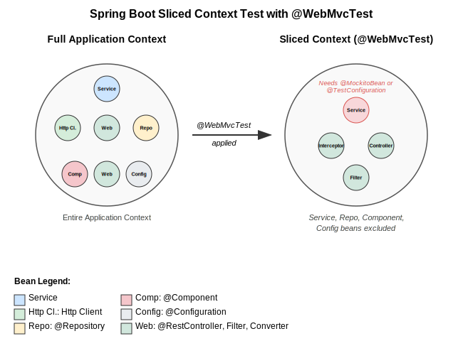

---


# Spring Test Profiler

### Unlock Spring's Most Unknown Testing Hidden Gem — Context Caching — and Achieve Faster Builds

<!--
PRESENTER NOTES:
- Welcome viewers with energy
- Introduce yourself briefly
- Set the stage: "Did you know Spring has a built-in context caching mechanism for tests? Most developers don't — and their builds pay the price."
- Transition: "Let me show you how to unlock this hidden gem with the Spring Test Profiler"
-->

---

<!-- header: 'Spring Test Profiler' -->
<!-- footer: '' -->


# The Problem: Slow Spring Test Suites

## Every unique context config = a new Spring context startup (2-10s each)

- Expensive Context Startup — each unique configuration triggers a full Spring context creation
- Hidden Duplicates — tiny config drifts silently create separate contexts that could be shared
- @DirtiesContext Overuse — destroys the cached context, forcing expensive recreation every time
- No Visibility — Spring's context cache is a black box with no built-in observability

<!--
PRESENTER NOTES (45 seconds):
- Emphasize the pain: "Imagine waiting 5 minutes for tests that could run in 30 seconds"
- "Tiny differences between test classes — an extra profile, a different property — silently create duplicate contexts"
- "Add @DirtiesContext and you're destroying and recreating contexts for every single test method"
- "The worst part? There's no built-in way to see what's happening inside Spring's context cache"
-->

---


# The Hidden Solution

## Spring TestContext Cache

Your tests are like web pages, contexts are like cached resources

**3 test classes sharing 1 context = Fast**
**3 test classes creating 3 contexts = Slow**

Cache keys affected by: `@TestPropertySource`, `@MockBean`, `@Profile`

<!--
PRESENTER NOTES (30 seconds):
- Use browser cache analogy: "Just like browsers cache resources to load pages faster"
- Show simple visual: 3 tests sharing vs creating separate contexts
- Quick mention of cache key factors
- The gap: "Spring has this powerful feature, but how do you actually see what's happening?"
-->

---



# Context Sharing Example

## When contexts get reused vs recreated

**Shared Context (Good)**
```java
@SpringBootTest
class UserServiceTest { }

@SpringBootTest
class OrderServiceTest { }
```

**Separate Contexts (Bad)**
```java
@SpringBootTest
class UserServiceTest { }

@SpringBootTest
@TestPropertySource(properties = "debug=true")
class OrderServiceTest { }
```

<!--
PRESENTER NOTES (30 seconds):
- Show concrete code examples
- Point out the tiny difference that breaks caching
- "This one line creates a completely new context"
- Transition: "Now you see the problem, but how do you find these issues in your own code?"
-->

---


# Spring Test Profiler

## The missing observability layer for your Spring tests

- **Context Cache Visualization** - See exactly what's being reused or wasted
- **Load Time Tracking** - Know how long each context takes to create
- **Context Comparison** - Diff two contexts to find what's different
- **Universal Compatibility** - Spring Boot 2.x through 4.x

<!--
PRESENTER NOTES (30 seconds):
- Hero moment: "Meet Spring Test Profiler"
- Emphasize key value props quickly
- "Complete visibility into your test performance in one HTML report"
- Transition: "Let me show you exactly how to set this up"
-->

---

# Setup in 3 Steps


## Step 1: Add the test dependency
```xml
<dependency>
  <groupId>digital.pragmatech.testing</groupId>
  <artifactId>spring-test-profiler</artifactId>
  <version>0.0.17</version>
  <scope>test</scope>
</dependency>
```

## Step 2: Register via spring.factories
```properties
# src/test/resources/META-INF/spring.factories
org.springframework.test.context.TestExecutionListener=\
digital.pragmatech.testing.SpringTestProfilerListener
org.springframework.context.ApplicationContextInitializer=\
digital.pragmatech.testing.diagnostic\
.ContextDiagnosticApplicationInitializer
```

## Step 3: Run your tests
```bash
mvn test   # or: gradle test
# Report: target/spring-test-profiler/latest.html
```

<!--
PRESENTER NOTES (30 seconds):
- "Setting up the profiler takes three steps"
- "First, add the test dependency to your pom.xml"
- "Second, register the listener and initializer in a spring.factories file under your test resources"
- "Third, just run your tests as you normally would — the report appears automatically"
-->

---

# The Report


## What You Get
- Summary dashboard with cache size, hits, misses, and hit rate
- Context cache entries with load times and test class mapping
- Context comparison visualizer to diff similar contexts
- Sorting and filtering by annotation type

## Report Location
```
target/spring-test-profiler/latest.html
```

<!--
PRESENTER NOTES (30 seconds):
- "The report opens with a summary dashboard showing cache hits, misses, and your hit rate"
- "Each cache entry shows load time, bean count, and which test classes use it"
- "The context comparison visualizer shows exactly what's different between two similar contexts"
- "Often it's just a single property or profile — easy to fix, big time savings"
-->

---

# Optimization in Action


## Problem Identified
Report shows: "Test classes creating separate contexts due to different @MockBean configurations"

## Quick Fix Applied
```java
// Before: Separate @MockBean in each test
// After: Shared @TestConfiguration
@TestConfiguration
static class TestConfig {
  @MockBean PaymentService paymentService;
  @MockBean NotificationService notificationService;
}
```

## Results: 47s to 12s (3x faster!)

<!--
PRESENTER NOTES (60 seconds):
- Show specific problem identification from report
- Demonstrate the actual code change
- Emphasize how small the change was
- Big reveal of results: "3x performance improvement with one small change"
- "This is the power of understanding what's actually happening in your tests"
-->

---

# Advanced Features

- Parallel Execution — full support for JUnit parallel and Maven Failsafe parallel tests
- JSON Export — CI/CD integration ready (beta)
- Build Tools — Maven and Gradle with automatic report placement
- Compatibility — Spring Boot 2.x through 4.x

<!--
PRESENTER NOTES (30 seconds):
- Quick run through advanced features
- Mention CI/CD integration possibilities with JSON export
- Emphasize broad compatibility
- "Whether you're on Spring Boot 2.7 or the latest 4.0, this tool works"
-->

---


# Get Started in 30 Seconds

## GitHub Repository
**github.com/PragmaTech-GmbH/spring-test-profiler**

## Easy Start
1. Add the dependency to your `pom.xml`
2. Register in `META-INF/spring.factories`
3. Run `mvn test` or `gradle test`
4. Open `target/spring-test-profiler/latest.html`

## Join the Community
Open Source — MIT License — Spring Boot 2.x through 4.x

**Star us on GitHub**

<!--
PRESENTER NOTES (30 seconds):
- Clear call to action with GitHub link
- "Getting started takes thirty seconds"
- "Add the dependency, register in spring.factories, run your tests, and open the report"
- "If this is useful, give us a star on GitHub — link in the description"
-->
